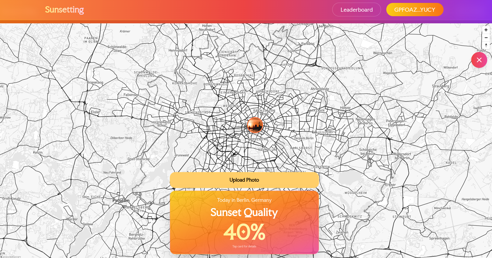
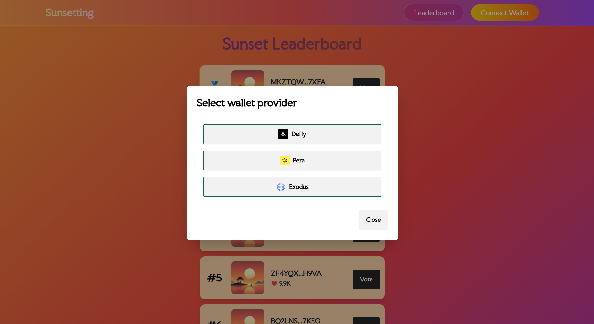

# On-Chain Sunset Beauty Calculator

This is a project for the [Algorand hackathon: AI meets Blockchain](https://luma.com/be27ik5w?tk=68T2qF) that took place on 3-4 September 2025 in [W3Hub](https://w3hub.berlin/), Berlin, Germany.

The project is a full-stack decentralized application built on Algorand that calculates sunset beauty probability using AI-powered weather analysis and features an interactive map interface with photo sharing capabilities.

The demo of this web app is deployed [here](https://sunsettings.vercel.app/) to Vercel.







## Project Overview

This project calculates the probability of a beautiful sunset based on the user's geolocation and weather conditions. Users can upload sunset photos to the interactive map, vote for the best photos, and receive rewards in Algo cryptocurrency for winning submissions.

**AI Sunset Calculation Process**: The system uses OpenAI GPT models with a sophisticated scoring algorithm that analyzes weather data including:
- cloud cover percentages, 
- precipitation, 
- humidity, 
- atmospheric conditions.
The AI calculates a 0-100 sunset beauty probability by applying weighted factors: base scoring from:
- total cloud cover (optimal 30-50%), 
- rain penalties, 
- humidity sweet spots, 
- haze dampening,
- overcast caps, 
- then generates concise descriptions of key atmospheric drivers. 

## Key Features

- **AI-Powered Sunset Analysis**: Uses OpenAI GPT models to analyze weather data and predict sunset quality
- **Interactive Mapbox Integration**: Full-screen map interface with location-based sunset predictions
- **Photo Upload & IPFS Storage**: Users can upload sunset photos with geolocation markers
- **Leaderboard System**: Community-driven ranking of sunset photos with voting mechanism
- **Wallet Integration**: Support for multiple Algorand wallets (Pera, Defly, Exodus, KMD)
- **Real-time Weather Data**: Integration with BrightSky weather API for accurate forecasting

## Prerequisites

- Python 3.12+
- AlgoKit CLI - Install following the https://github.com/algorandfoundation/algokit-cli#install
- Docker - Required for local Algorand development
- Node.js 20.0+ and npm 9.0+

## Environment Variables Required

The application requires several environment variables to be configured. Create a `.env` file in the `frontend/` directory with the following variables:

### Required API Keys
```bash
# OpenAI API - For sunset quality analysis
VITE_OPENAI_API_KEY=your_openai_api_key
VITE_OPENAI_MODEL=gpt-4o-mini

# Mapbox - For interactive map functionality
VITE_MAPBOX_TOKEN=your_mapbox_token

# Piñ ata IPFS - For photo storage (choose one option)
# Option 1: JWT Token (preferred)
VITE_PINATA_JWT=your_pinata_jwt_token

# Option 2: API Key + Secret
VITE_PINATA_API_KEY=your_pinata_api_key
VITE_PINATA_API_SECRET=your_pinata_api_secret
```

### Algorand Network Configuration
```bash
# Environment
VITE_ENVIRONMENT=localnet

# Algod Client Configuration
VITE_ALGOD_TOKEN=your_algod_token
VITE_ALGOD_SERVER=your_algod_server
VITE_ALGOD_PORT=your_algod_port
VITE_ALGOD_NETWORK=localnet

# Indexer Configuration
VITE_INDEXER_TOKEN=your_indexer_token
VITE_INDEXER_SERVER=your_indexer_server
VITE_INDEXER_PORT=your_indexer_port

# KMD Configuration (for local development)
VITE_KMD_TOKEN=your_kmd_token
VITE_KMD_SERVER=your_kmd_server
VITE_KMD_PORT=your_kmd_port
VITE_KMD_PASSWORD=your_kmd_password
VITE_KMD_WALLET=your_kmd_wallet
```

## Setup

### Initial Setup

1. Clone this repository to your local machine
2. Create `.env` file in the `frontend/` directory with the environment variables listed above
3. Install dependencies with `npm install`

## Development

- Start frontend development server: `npm run dev` (from frontend directory `/frontend`)

## Frontend Architecture

The frontend is built with React 18 + TypeScript + Vite and includes:

- React Router - Multi-page navigation (Home, Leaderboard)
- Tailwind CSS + daisyUI - Responsive styling framework
- MapboxGL - Interactive mapping functionality
- AlgoKit Utils - Algorand blockchain integration
- TxnLab Use-Wallet - Multi-wallet support

## Key Components

### Sunset Components (`/components/sunset/`)
- `HeroSection.tsx` - Main sunset calculator interface with location detection and AI-powered analysis
- `MapFullScreen.tsx` - Interactive Mapbox map with photo markers, predictions, and full-screen view
- `Leaderboard.tsx` - Community photo ranking system with voting and blockchain transactions
- `PhotoUpload.tsx` - IPFS-based photo storage with metadata and geolocation
- `LocationSelector.tsx` - Location search and selection interface
- `PhotoMarker.tsx` - Map markers for displaying uploaded photos
- `PhotoPopup.tsx` - Modal for viewing photo details and interactions

### UI Components (`/components/ui/`)
- `FlipCard.tsx` - Animated sunset prediction display with flip animation
- `ErrorBoundary.tsx` - Error handling and fallback UI components

### Layout Components (`/components/layout/`)
- `Header.tsx` - Navigation header with wallet connection and menu

### Wallet Components (`/components/wallet/`)
- `ConnectWallet.tsx` - Multi-wallet connection interface (Pera, Defly, Exodus, KMD)
- `Account.tsx` - Wallet account information and management
- `Transact.tsx` - Transaction handling and blockchain interactions

## API Integrations

- OpenStreetMap Nominatim - Geocoding and reverse geocoding
- BrightSky Weather API - Hourly weather data for sunset predictions
- OpenAI API - AI-powered sunset quality analysis
- Mapbox Maps API - Interactive map rendering
- Piñata API - IPFS (used for images)

---

This project is forked from the Algorand's [AlgoKit QuickStart Template](https://github.com/Ganainmtech/Algorand-dApp-Quick-Start-Template-TypeScript) and extended with sunset prediction and photo-sharing functionality.

Built with https://github.com/algorandfoundation/algokit-cli • Algorand Blockchain • React • TypeScript

This project is licensed under the Apache License 2.0. 